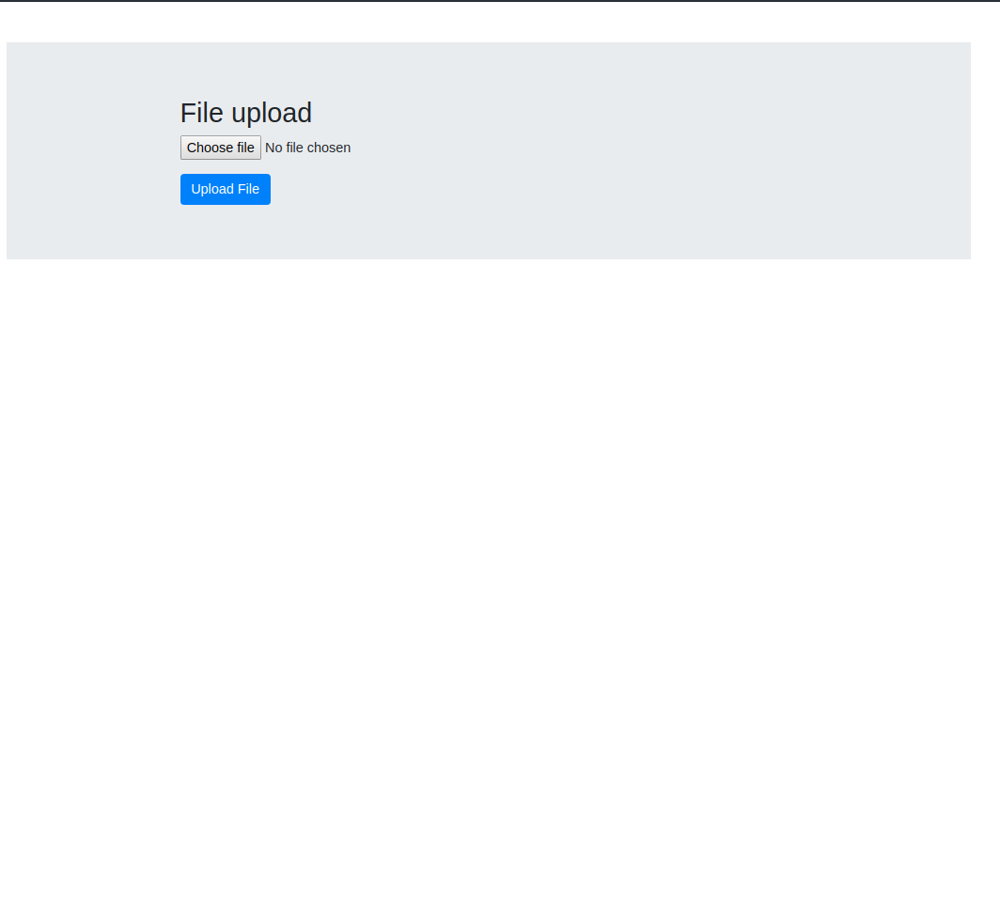
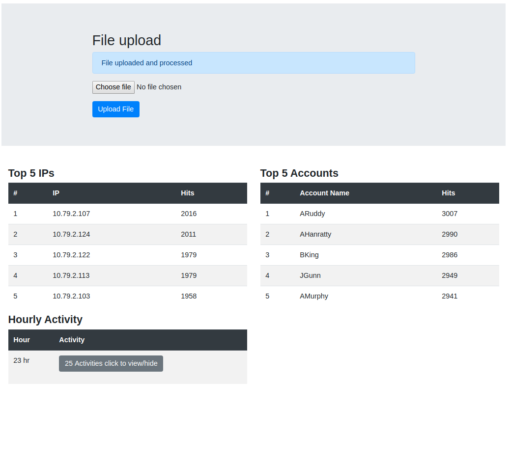
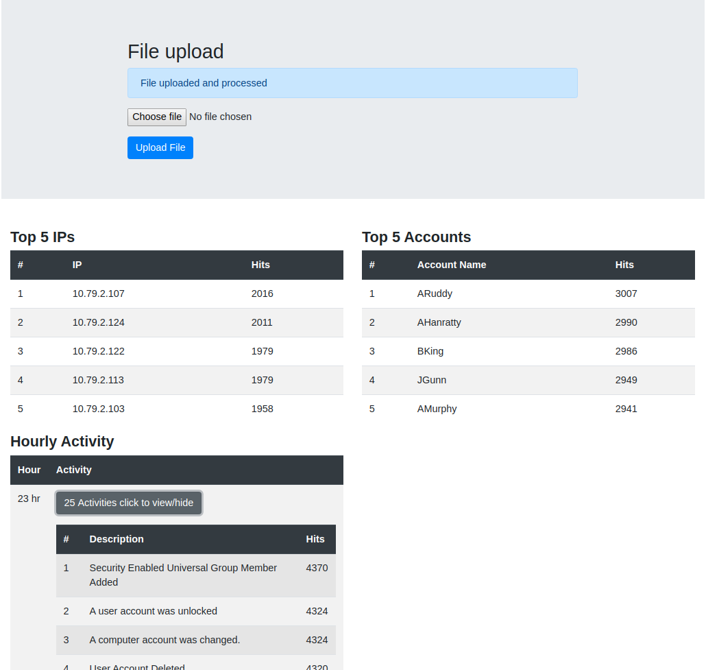

# Tech Stack

1. Java 8
2. SpringBoot
3. thymeleaf
4. Html, CSS, JS

# How to run

1. Navigate to project folder
2. Execute command : mvn clean package
3. Navigate to target folder
4. Run Jar file using java -jar filename
5. Open this url in any browser: http://localhost:8080
6. Upload correct file 

